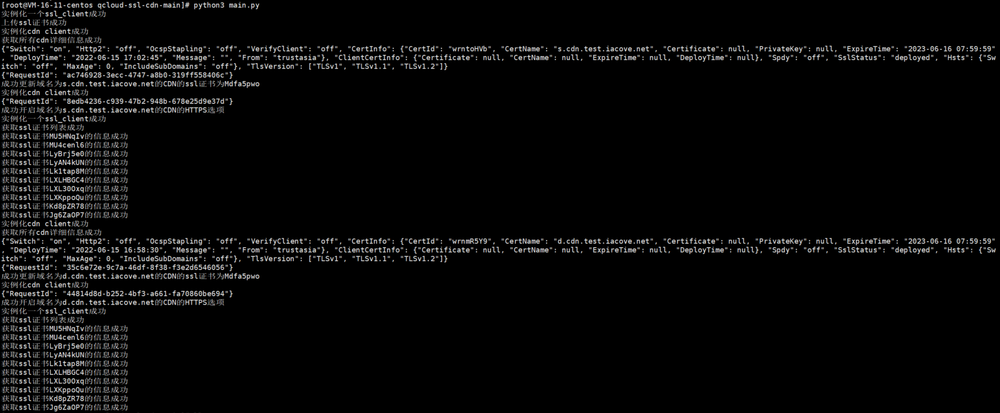

## 一、环境准备

### 1. 安装 acme.sh

在服务器上执行以下命令安装 acme.sh：

```bash
curl https://get.acme.sh | sh -s email=eclipseman@163.com
```
或者
```bash
wget -O -  https://get.acme.sh | sh -s email=eclipseman@163.com
```

### 2. 配置 shell alias

编辑 `~/.bashrc` 文件，添加以下内容：

```bash
alias acme.sh=~/.acme.sh/acme.sh
```

保存并退出后，执行以下命令使配置生效：

```bash
source ~/.bashrc
```

### 3. 设置腾讯云 API 密钥

编辑 `/etc/profile` 文件，添加以下内容：

```bash
export Tencent_SecretId="你的腾讯云SecretId"
export Tencent_SecretKey="你的腾讯云SecretKey"
```

保存并退出后，执行以下命令使配置生效：

```bash
source /etc/profile
```

## 二、申请 SSL 证书

由于 `s.cdn.test.iacove.net` 和 `d.cdn.test.iacove.net` 是多个子域名，需要为它们申请同级别泛域名证书。

### 1. 创建证书存储目录

```bash
mkdir -p /home/ssl/autocdn/cdn.test.iacove.net
```

### 2. 申请证书

#### 为 *.cdn.test.iacove.net 申请证书

```bash
acme.sh --dns dns_tencent --issue -d *.cdn.test.iacove.net
```


### 3. 安装证书到指定位置

#### 安装 *.cdn.test.iacove.net 的证书

```bash
acme.sh --installcert -d *.cdn.test.iacove.net \
        --key-file /home/ssl/autocdn/cdn.test.iacove.net/*.cdn.test.iacove.net.key \
        --fullchain-file /home/ssl/autocdn/cdn.test.iacove.net/fullchain.cer \
        --reloadcmd "/usr/sbin/nginx -s reload"
```


## 三、上传证书到腾讯云并配置 CDN

### 1. 安装 qcloud-ssl-cdn

从 GitHub 克隆项目：

```bash
git clone https://github.com/zfb132/qcloud-ssl-cdn.git
cd qcloud-ssl-cdn

如果克隆不下来，直接下载压缩包上传到服务器，解压到对应目录（/home/qcloud-ssl-cdn/cdn.test.iacove.net）
```

### 2. 配置参数

编辑 `config.example.py` 文件，根据注释修改每一项内容，特别是以下部分：

```python
#!/usr/bin/env python
# -*- coding: utf-8 -*-
# author: 'zzh'
# time: 2025-3-13 11:15

# 腾讯云支持使用单域名和泛域名的证书，例如
# acme.sh --issue  -d "ndlink.cn" -d "*.ndlink.cn" --dns dns_dp
# acme.sh --issue  -d "blog.ndlink.cn" --dns dns_dp

# 使用ACME申请的SSL完整证书的本地存放路径
CER_FILE = "/home/ssl/autocdn/cdn.test.iacove.net/fullchain.cer"

# 使用ACME申请的SSL证书私钥的本地存放路径
KEY_FILE = "/home/ssl/autocdn/cdn.test.iacove.net/*.cdn.test.iacove.net.key"

# CDN服务配置的域名（需要提前在腾讯云网页前端创建）
# 如果ACME申请的证书为泛域名证书，且要配置多个CDN加速
# CDN_DOMAIN = ["blog.ndlink.cn", "blog2.ndlink.cn", "web.ndlink.cn"]
CDN_DOMAIN = ["s.cdn.test.iacove.net","d.cdn.test.iacove.net"]

# 腾讯云：https://console.cloud.tencent.com/cam/capi
SECRETID = "你的腾讯云SecretId"
SECRETKEY = "你的腾讯云SecretKey"

# CDN：控制功能开关
# 是否进行上传证书文件的操作（根据CER_FILE和KEY_FILE）
UPLOAD_SSL = True
# 以下为HTTPS额外功能
# 是否开启HTTP2
ENABLE_HTTP2 = True
# 是否开启HSTS
ENABLE_HSTS = True
# 为HSTS设定最长过期时间（以秒为单位）
HSTS_TIMEOUT_AGE = 1
# HSTS包含子域名（仅对泛域名有效）
HSTS_INCLUDE_SUBDOMAIN = True
# 是否开启OCSP
ENABLE_OCSP = True
# 是否删除适用于CDN_DOMAIN域名下的其他所有证书
# 满足以下条件：证书适用于CDN_DOMAIN、证书id不是本次使用的id
DELETE_OLD_CERTS = True

# 是否进行为CDN_DOMAIN更换SSL证书的操作
# 若UPDATE_SSL = True且UPLOAD_SSL = True，则CERT_ID可不设置，直接利用UPLOAD_SSL的证书
UPDATE_SSL = True

# 是否为腾讯云直播域名更换SSL证书的操作
# 若UPDATE_LIVE_SSL = True 注意请将UPDATE_SSL、ENABLE_HSTS、ENABLE_OCSP、ENABLE_HTTP2 设置为 False
UPDATE_LIVE_SSL = True

CERT_ID = ""
# 是否进行预热URL的操作
PUSH_URL = False
# 是否进行刷新URL的操作
PURGE_URL = False
# 自定义的预热URL（默认会预热sitemap.xml的所有链接）文件路径
# 该文件内，每行一个URL
URLS_FILE = "urls.txt"

# 仅用于边缘安全加速平台EO更换SSL证书，不用于CDN
# 区域ID：可以手动利用函数get_teo_zones_list获取所有的加速区域ID；格式为 zone-xxxxxx
ZONE_ID = ""
```

然后将文件重命名为 `config.py`。

```bash
mv config.example.py config.py
```


### 3. 执行脚本

```bash
python3 main.py
```

### 4. 执行脚本报错解决

```bash
错误一：ModuleNotFoundError: No module named 'tencentcloud'
解决：pip3 install tencentcloud-sdk-python

错误二：ModuleNotFoundError: No module named 'certifi'
解决：pip3 install certifi

问题解决后，重新执行脚本即可：python3 main.py
```



## 四、设置自动更新

### 1. 创建更新脚本

```bash
vim /usr/local/bin/update_cdn_cert.sh
```

添加以下内容：

```bash
#!/bin/bash

# 更新 *.cdn.test.iacove.net 证书
acme.sh --dns dns_tencent --issue -d *.cdn.test.iacove.net --force

# 重新安装 *.cdn.test.iacove.net 证书
acme.sh --installcert -d *.cdn.test.iacove.net \
        --key-file /home/ssl/autocdn/cdn.test.iacove.net/*.cdn.test.iacove.net.key \
        --fullchain-file /home/ssl/autocdn/cdn.test.iacove.net/fullchain.cer \
        --reloadcmd "/usr/sbin/nginx -s reload"


# 上传证书到腾讯云并更新 CDN
python3 /home/qcloud-ssl-cdn/cdn.test.iacove.net/main.py
```

赋予脚本执行权限：

```bash
chmod +x /usr/local/bin/update_cdn_cert.sh
```

### 2. 设置定时任务

编辑 crontab 文件：

```bash
crontab -e
```

添加以下内容，设置每月 1 号凌晨 2 点执行证书更新：

```bash
0 2 1 * * /usr/local/bin/update_cdn_cert.sh
```

## 五、验证配置

### 1. 查看证书文件

```bash
ls /home/ssl/autocdn/cdn.test.iacove.net
```

应能看到对应的 `.key` 和 `.cer` 文件。

### 2. 检查 Nginx 配置

确保 Nginx 配置文件中 SSL 证书路径正确（cdn证书可不用检查）：

```nginx
ssl_certificate  /home/ssl/autocdn/cdn.test.iacove.net/fullchain.cer;
ssl_certificate_key /home/ssl/autocdn/cdn.test.iacove.net/*.cdn.test.iacove.net.key;
```

### 3. 测试证书更新流程

手动执行更新脚本，观察是否有错误：

```bash
/usr/local/bin/update_cdn_cert.sh
```

可能得报错：
```bash
[root@VM-0-12-centos ~]# /usr/local/bin/update_cdn_cert.sh
/usr/local/bin/update_cdn_cert.sh: line 6: acme.sh: command not found
/usr/local/bin/update_cdn_cert.sh: line 9: acme.sh: command not found
```

解决方案：
```bash
export PATH=$PATH:~/.acme.sh
将这行添加到 /etc/profile 或 ~/.bashrc 中，然后重新加载配置文件：
source /etc/profile
```

## 六、注意事项

- **权限问题**：确保脚本和相关文件有正确的执行权限。
- **腾讯云 API 配额**：注意腾讯云 API 的调用频率限制，避免因频繁调用导致被限制。
- **证书有效期**：Let's Encrypt 证书有效期为 90 天，确保定时任务正常执行以避免证书过期。